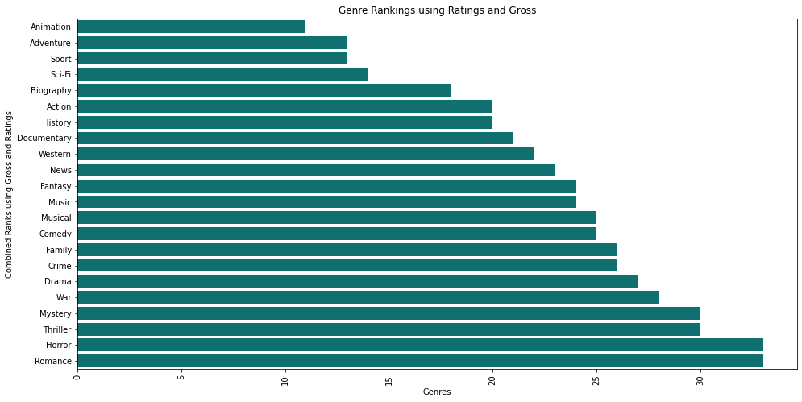
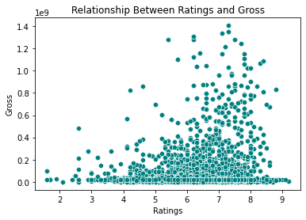
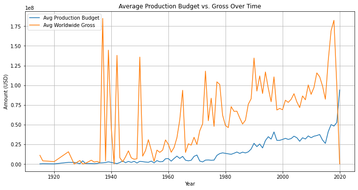
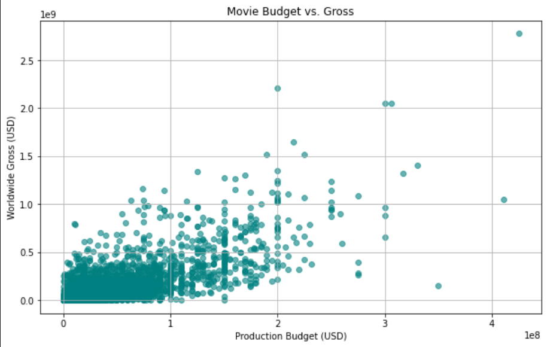
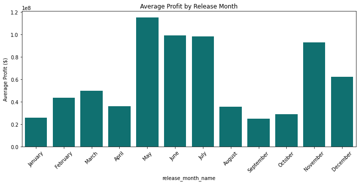
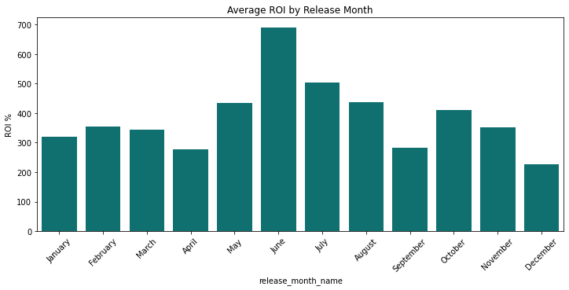

# **Urban Productions: Movie Production Analysis**. 
## **Business Understanding**

### **Overview**
Urban Enterprises is a company that has decided to venture into the movie production industry and wants to build a new studio.   
The head of studio needs to know what type of films/movies to create.  
Our goal is to analyze movie performance data to provide insights on movie production.  
We are using datasets from: *Box Office Mojo*, *IMDB* and *The Numbers*

### **Problem Statement**
The company barely has any knowledge on what it entails to run a successful movie production business. Therefore, it requires research done on what types of films are currently doing the best in the industry. The stakeholders need meaningful insights on movie trends, ie the top performing genres, in order to make decisions that will eventually be profitable for the investment.

### **Objectives**

1. Determine the best movie genres by examining total gross and movie ratings for the business to take steps that will maximize their profits and ensure return of investment.

2. Evaluate if there is correlation between movies total gross and their ratings.

3. Compare production budgets for movies with their total gross. Examine whether there is an increase in production budget over the years, and if the gross is keping up with it.

4. Explore whether movie release dates/months affect their performance to suggest the best release strategies.

### **Data Visualizations and Interpretations**

## **Recommendations**
1. According to our rank, the best performing genre in the film industry is Animation, followed by Adventure and Sport. Thriller, Horror and Romance are the least rewarding genres to invest in. Therefore, we recommend that Urban Productions invests more in Animation, Adventure and Sport genres.

2. As studios spend more on movies' production budget, the gross earned increases too. It is recommendable to allocate high budgets for films since viewers reward the spending, which ensures return of profits.

3. Movies do best within the May to July period. On the other hand, January, September and October are the least performing months in the film industry. It is hence ideal to have movie releases during the May to July period.

## **Conclusions**
Overall, the project provided valuable insights into the factors influencing movie success in the film industry. By analyzing genres, production budgets, and release periods, we identified trends that affect a film’s performance. The findings show that a movie's success is determined by genre selection, sufficient budgeting and strategic release timing. Therefore, this analysis guides Urban Productions in making informed decisions in venturing into the film industry.
